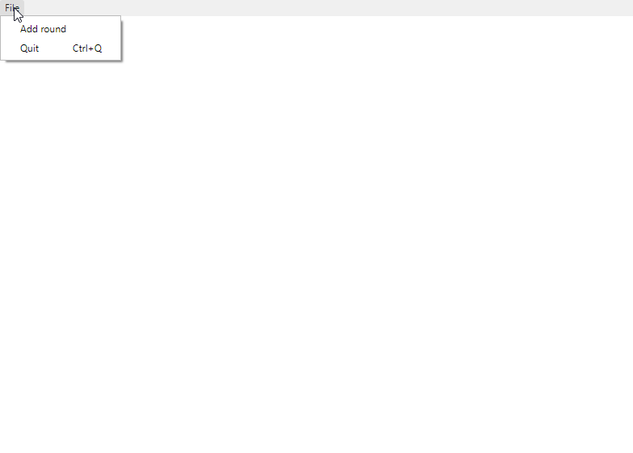

# Electron Tutorial

Electron ist ein Framework für NodeJS für die Entwicklung von nativen Desktop Apps mit HTML, CSS und JavaScript. Es wurde ursprünglich für den Atom Editor von Github entwickelt und ist unter der MIT-Lizens Open-Source verfügbar. Die aktuelle Version ist v5.0.0.

## Funktionsweise
Electron ermöglicht das Erstellen von UIs mit HTML und CSS. Um das möglich zu machen verwendet es Chromium als HTML-Renderer, welcher als kleiner Browser die eigentliche Anwendung rendert. Zudem lässt sich das Menü von Chromium in der Anwendung verändern und auf die Anwendung anpassen, so kann viel Arbeit eingspart werden.
## Einrichten eines Projekts
Nach dem Erstellen eines Node Projektes kann mit dem Befehl ```npm i -D electron@latest``` die aktuellste Version von Electron im Projekt installiert werden. 
Danach kann ein neues Fenster mit dem ```BrowserWindow``` Objekt geöffnet werden und für dieses eine Datei oder eine URL mit der HTML Seite laden. Das ganze macht man am besten wenn die Anwendung bereit ist, dafür gibt es das ```ready```-Event welches gefeuert wird, sobald die Anwendung einsatzbereit ist.
```javascript
app.on('ready', function() {
    //Create new Window
    mainWindow = new BrowserWindow({webPreferences: {nodeIntegration: true}});

    //load html file
    mainWindow.loadURL(url.format({
        pathname: path.join(__dirname, 'index.html'),
        protocol: 'file:',
        slashes: true
}));
```
Um das Menü zu manipulieren, muss zunächst ein MenuTemplate erstellt werden. Dieses ist ein Objekt, welches die Form und Funktion des Menüs definiert. 
```javascript
const mainMenuTemplate = [
    {
        label: 'File',
        submenu:[
            {
                label: 'Add Round',
                click(){
                    addItem();
                }
            },
            {
                label: 'Quit',
                click(){
                    app.quit();
                }
            }
        ]
    }
];
```
Wenn ein Tastatur-Shortcut für eine Funktion verfügbar sein soll, kann man zusätzlich einen ```accelerator``` definieren, bei welchem man den Shortcut definieren kann. Wichtig hierbei ist, das bei Macs die Tastatur unterschiedlich ist. Es muss also vorher überprüft werden, aus welchem System man sich befindet, wenn man die Anwendung für alle Plattformen verfügbar machen möchte.
```javascript
{
    label: 'Quit',
    accelerator: process.platform == 'darwin' ? 'Command+Q' : 'Ctrl+Q',
    click(){
        app.quit();
    }
}
```
Wenn das MenuTemplate fertig ist, kann man mit dem Menu-Objekt von Electron daraus ein Menu erstellen und das als Menü für die Anwendung laden. 
```javascript
 // Build menu from template
const mainMenu = Menu.buildFromTemplate(mainMenuTemplate);
Menu.setApplicationMenu(mainMenu);
```

## Senden von Daten von der Applikationslogik zur Oberfläche
Damit Daten von der Applikationslogik in der index.js zur Logik in der index.html gesendet werden können, stellt Electron Events bereit, welche über den ```ipcRenderer``` in der Applikationslogik abgefangen werden können. Um ein Event in der index.js zu senden, wird die entsprechende Funktion für das gewünschte Fenster aufgerufen.
```javascript
mainWindow.webContents.send('example:event', data);
```
Um das Event anschließend im UI abzufangen, wird dort für ```ipcRenderer``` eine Funktion gesetzt, welche die Daten verarbeitet.
```javascript
const electron = require('electron');
const { ipcRenderer } = electron;

ipcRenderer.on("example:event", function (e, data) {
    doSomethingWithData(data);
});
```
Für eine vollständige Anwendung mit Electron, werft einen Blick auf die [Beispielanwendung](../timer/)

## Build
Um die Anwendung zu exportieren, empfiehlt sich der ```electron-packager```, diesen installiert man mit dem Befehl ```npm install electron-packager --save-dev```.
Anschließend kann man in der package.json die Build-Befehle für die unterschiedlichen Plattformen definieren. Hier als Beispiel:
```
"scripts": {
    "start": "electron .",
    "package-mac": "electron-packager . --overwrite --platform=darwin --arch=x64 --prune=true --out=release-builds",
    "package-win": "electron-packager . timer --overwrite --asar=true --platform=win32 --arch=ia32 --prune=true --out=release-builds --version-string.CompanyName=CE --version-string.FileDescription=CE --version-string.ProductName=\"timer\"",
    "package-linux": "electron-packager . timer --overwrite --asar=true --platform=linux --arch=x64 --prune=true --out=release-builds"
},
```
Anschließend lässt sich die Anwendung mit ```npm run package-win``` builden. Die fertige Anwendung findet sich anschließend im Ordner release-build.
## Literatur
* [electronjs.org](https://electronjs.org)